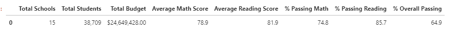
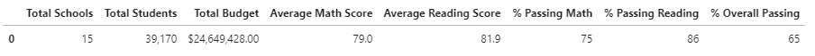
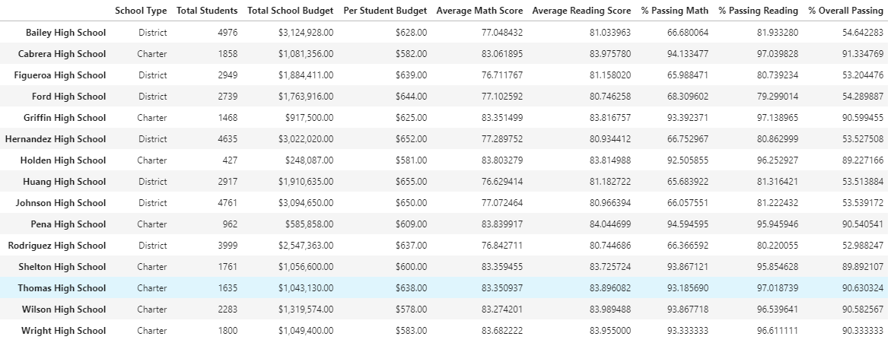
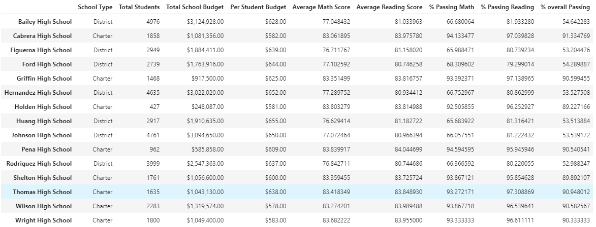
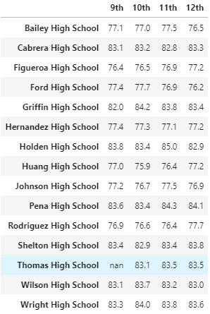
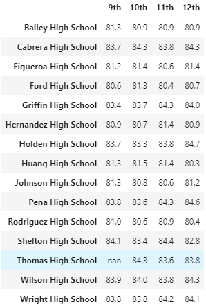
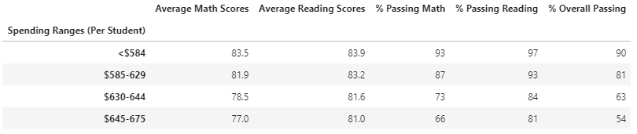
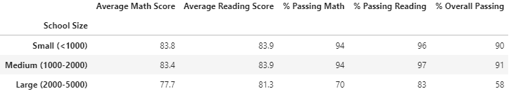

# School_District_Analysis
Using Pandas library in python and Jupyter Notebook or Lab, to analyze school's performances. 

## Project Overview
To Analyze A school district's standards in regards to students grades with respect to scores in math, reading and overall school's performance.

The district school board has notified Maria and her supervisor that there is evidence of dishonesty with grades related to math and reading for Thomas High School 9th graders that apprered to be altered. Since, the school board does not know the extent of this dishonesty, they wanted Maria and her supervisor to uphold the state-testing standards and report the difference.

## Resources

- Data Source 1: schools_complete.csv
- Data Source 2: students_complete.csv
- Software: Jupyter Lab v.2.2.6, Visual Studio Code: 1.49.1

## Results 

### Overall District Analysis & summary

- District scores in regards to math, reading and overall (both math and reading) percentage, there is a slight change noticed with these metrics because of Thomas High School (THS) ongoing investigation, the 9th graders will have their scores taken nullified or not considered. 
- Total number of students will change due to the 461 student scores from 9th grade THS will be taken off respectively.
- School budget remained the same.
- Average math score dropped 0.1% from the previous analysis due to THS
- Average reading score remained the same.
- Percentage passing math dropped 0.2%
- Percentage passing reading dropped 0.3%
- Overall percentage change is 0.1%, 65% to 64.9% 

District Data After Thomas High School Grade 9 scores Removed: 

District Data Before:

### School Analysis & Summary

School Data After Thomas High School Grade 9 Scores Removed:

- There is a slight increase with average reading score and percentage this is due the reduced number of students, and the average of scoring with the other grades 10th-12th was high.
- slight drop but negligible with average math scores.
- overall percentage dropped from 90.94% to 90.63%.

School data Before:

### Schools Performance (TOP 5 & BOTTOM 5)

- No changes with schools performance in order, even after Thomas High School 9th grader students scores was not considered. 
- Cabrera High School with 91.33% overall when compared to Thomas High in second place with 90.63%
- Rodriguez High School having the lowest overall percentage of 52.98%

Top 5 After Thomas High Removed:

Bottom 5 After Thomas High removed:

### Results of Math Score After Thomas High Removed:

### Results of Reading Score After Thomas High Removed:

### Results by School Spending After Thomas High Removed:

- No changes on scores with respect to school spending.

### Results by School Size After Thomas High Removed:

- No changes on scores with respect to school size.

### Results by School Type After Thomas High Removed:

- No changes on scores with respect to school type.

## Summary

- The four main things that changed when Thomas High School grade 9 scores was removed. 

1. Average math scores dropped 
2. Percentage passing in math dropped from 75% to 74.8%
3. Percentage passing in reading also dropped 0.3% -  86% to 85.7%
4. The overall passing rate dropped from 65% to 64.9% which is a 0.1% change

